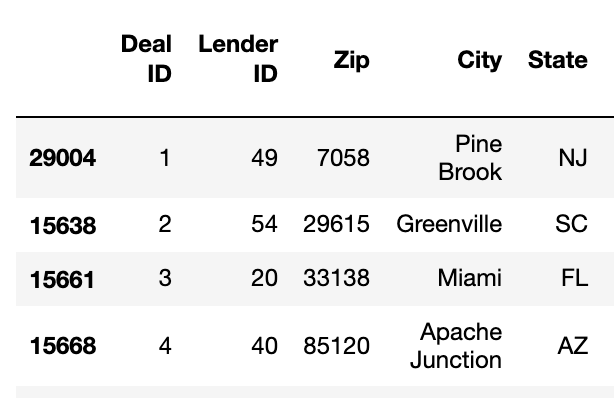
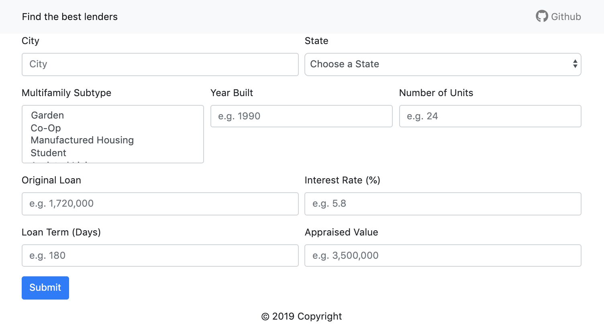
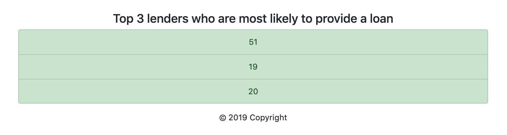
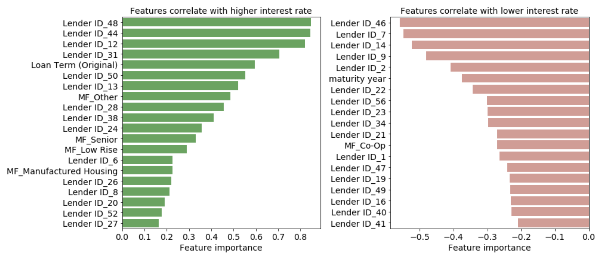

# Predict Potential Lenders

- [Predict Potential Lenders](#predict-potential-lenders)
  - [1. Background](#1-background)
  - [2. Dataset](#2-dataset)
  - [3. File Descriptions](#3-file-descriptions)
  - [4. Instructions to run the web application](#4-instructions-to-run-the-web-application)
  - [5. Python version and libraries](#5-python-version-and-libraries)
  - [6. Results and screenshots](#6-results-and-screenshots)

## 1. Background

This project uses data of real estate loaning deals to solve 3 problems:

- **Probalem 1:** Use Google Geocoding API to get City and State names based on Zip Code.
- **Probalem 2:** Classify top 3 lenders who are most likely to provide the loan.
  - Problem 2.1: Build a classification algorithm to predict lenders and their probabilities
  - Problem 2.2: Build a [web application](https://find-lenders.herokuapp.com/) that uses the algorithm to predict lenders based on user inputs
- **Probalem 3:** Find the variables that correlate with higher interest rate.

## 2. Dataset

The dataset of ~30K real estate loan deals was given by [Enodo](https://www.enodoinc.com/)

Variables list:

- `Deal ID`, `Lender ID`, `Zip`, `City`* (blank to be filled), `State`* (blank to be filled), `Multifamily Subtype`*, `Built`*, `Units`*, `Original Loan`*, `Note Rate`*, `Loan Term (Original)`*, `Appraised Value`*, `Maturity Date`, `UPB` , `Amort DSvc`, `Orig Amort`, `IO Period`
- Features with * were used to solve Problem 2.
- All features were used to solve Problem 3.

## 3. File Descriptions

- `app`
  - `template`
    - `master.html`: homepage of web app
    - `go.html`: classification result page of web app
  - `static`
    - `js`
      - `app.js`: JavaScript file that supports `master.html`
  - `app.py`: Flask file that runs web app
  - `utils.py`: customized functions that support `app.py`
  - **IMPORTANT:** in order to run the web app, please add a `config.py` file that specifies your own Google Geocoding API Key `google_api_key = MY-GOOGLE-API-KEY`.

- `data`
  - `lender_data.csv`: raw lender data to be processed
  - `lender_data1.db`: lender data processed by `part1.ipynb`

- `model`
  - `model_rf.pkl`: trained classification model that predicts most likely lenders
  - `features.pkl`: input features of the classification model
  - `imputer.pkl`: fitted imputer to preprocess data for the classification model
  - `scaler.save`: fitted scaler to preprocess data for the classification model

- `notebook`
  - `part1.ipynb`: notebook that solves Problem 1
  - `part2.ipynb`: notebook that solves Problem 2.1
  - `part3.ipynb`: notebook that solves Problem 3
  - **IMPORTANT:** in order to run the notebooks, please add the following
    - a `config.py` file that specifies your own Google Geocoding API Key `google_api_key = MY-GOOGLE-API-KEY`
    - a `temp` folder at this level

## 4. Instructions to run the web application

1. Run the following command in the `app` directory to launch the web app: `python app.py`.  
2. Go to http://0.0.0.0:3001/.

## 5. Python version and libraries

The code was developed using the Anaconda distribution of Python version 3.6. The following dependencies were used.

`pandas`  
`numpy`  
`sqlalchemy`  
`sklearn`  
`flask`  
`matplotlib`  
`seaborn`  
`requests`  
`pickle`  

## 6. Results and screenshots

- **Problem 1:** Retrieve city and state based on zip code

    

- **Problem 2:** Classify top 3 most likely lenders

    - Classifier that predicts top 3 lenders and their probabilities: see `part2.ipynb`
    - [Web app](https://find-lenders.herokuapp.com/)
      - Homepage  
          
      - Classification result  
          

- **Problem 3:** Identify variables that correlate with high interest rate

     
    Some of the lenders and loan term correlate strongly with higher interst rate.
